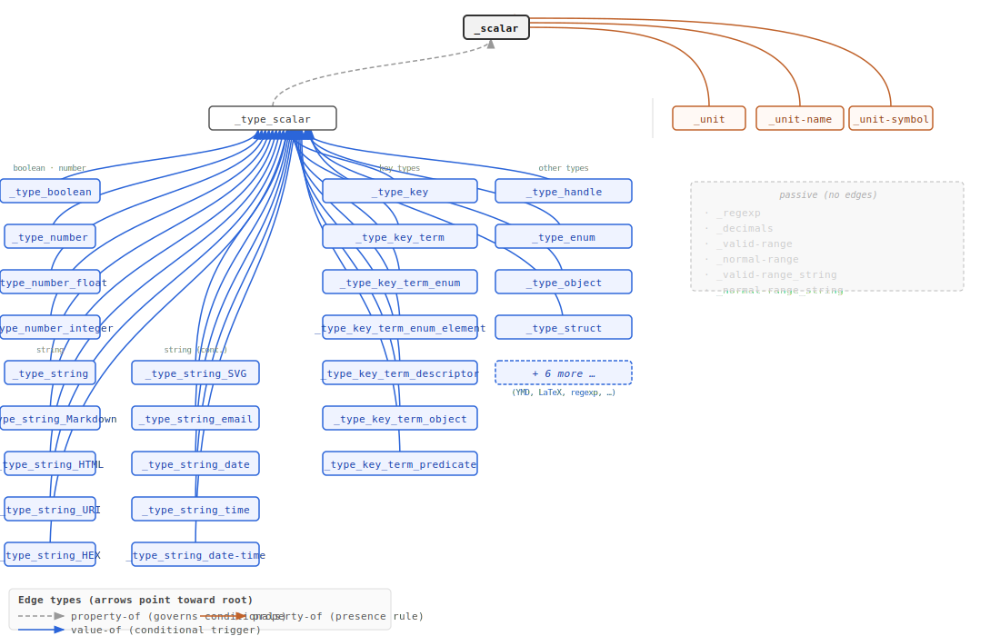

# Data Dictionary Reference

This document is the authoritative reference for the structure and mechanics of the metadata store data dictionary. It describes how terms are defined, how data types are expressed, how graphs encode relationships, and how all the mechanisms fit together. For a definition of any individual term, consult its term card in [`docs/`](../). For the source data, see [`data/core/`](../../data/core/).

---

## 1. Introduction

The metadata store is a database-hosted data dictionary and metadata repository. It is stored in an [**ArangoDB**](https://arango.ai) graph database and serves two purposes: it defines the vocabulary used to describe data (the dictionary's own building blocks), and it provides a framework for hosting any number of domain-specific data standards on top of that vocabulary.

The dictionary is **self-describing and recursive**: the properties and structures that make up the dictionary are themselves defined as terms within it. A term describing a country, for example, is structured using the same mechanisms as a term describing what a floating-point number is.

The dictionary is organised as a [directed graph](https://en.wikipedia.org/wiki/Directed_graph). **Terms** are nodes, stored as documents in ArangoDB collections. **Relationships** between terms are edges, stored in ArangoDB edge collections. The combination of document structure and graph edges gives the dictionary both a rich internal schema and flexible, traversable relationship semantics.

---

## 2. Core Concepts and Terminology

| Concept | Meaning |
|---|---|
| **Term** | The fundamental unit of the dictionary. A [JSON](https://json-schema.org) document whose sections determine its identity, documentation, data type, classification, and real-world properties. |
| **Descriptor** | A term that carries a [`_data`](../_data.md) section. [Descriptors](https://en.wikipedia.org/wiki/Data_descriptor) represent typed data variables — they define what kind of value a field holds. |
| **Enumeration** | A [controlled vocabulary](https://en.wikipedia.org/wiki/Controlled_vocabulary). A set of terms organised as a graph whose root defines the value domain and whose nodes are the allowed values. |
| **Typedef** | A descriptor term whose primary purpose is to define a reusable data shape, referenced by other descriptors via the [`_typedef`](../_typedef.md) mechanism rather than used as an ordinary variable. |
| **Alias** | A term that carries only a [`_code`](../_code.md) section and delegates all content to a canonical term via graph edges. Used to expose alternative identifiers or curated subsets without duplicating content. |
| **Namespace** | A term whose [`_gid`](../_gid.md) is used as the [`_nid`](../_nid.md) (namespace identifier) of other terms. [Namespaces](https://en.wikipedia.org/wiki/Namespace) organise terms into hierarchies. |

---

## 3. Term Structure

A term is a JSON document with top-level **sections**. The sections present determine the term's role and behaviour.

| Section | Required | Purpose |
|---|---|---|
| [`_code`](../_code.md) | Always | Identifiers: local ID, namespace, computed global ID, and secondary codes |
| [`_info`](../_info.md) | Always, except alias terms | Human-readable documentation: title, definition, description, examples |
| [`_data`](../_data.md) | Descriptor terms only | The type and shape of the data the term represents |
| [`_domn`](../_domn.md) | Optional | Classification and categorisation of the term within the dictionary |
| [`_prop`](../_prop.md) | Optional | Factual attributes of the real-world entity the term represents |

Every term must carry [`_info`](../_info.md) with at least a [`_title`](../_title.md), so that every term is understandable by a human reader. The sole exception is an **alias term**, which carries only [`_code`](../_code.md) and delegates its content to a canonical term via graph edges (see [Section 12](#12-alias-terms)).

The ArangoDB system fields [`_id`](../_id.md), [`_key`](../_key.md), and [`_rev`](../_rev.md) are present on every stored document but are never written to the source JSON files. [`_key`](../_key.md) is derived from [`_gid`](../_gid.md) at insertion time; [`_id`](../_id.md) and [`_rev`](../_rev.md) are assigned by ArangoDB.

---

## 4. Identifiers — the [`_code`](../_code.md) Section

The [`_code`](../_code.md) section provides all identifiers for a term.

### Core identifier properties

| Property | Required | Description |
|---|---|---|
| [`_lid`](../_lid.md) | Yes | Local identifier within the term's namespace. |
| [`_nid`](../_nid.md) | No | Namespace: the [`_gid`](../_gid.md) of the parent namespace term. |
| [`_gid`](../_gid.md) | Computed | Global unique identifier. Computed from [`_nid`](../_nid.md) and [`_lid`](../_lid.md); copied to [`_key`](../_key.md) before insertion. |
| [`_aid`](../_aid.md) | Computed | All identifiers: the full set of official identifiers for the term. Defaults to `[_lid]`. |

### [`_gid`](../_gid.md) computation

[`_gid`](../_gid.md) is computed by concatenating [`_nid`](../_nid.md) and [`_lid`](../_lid.md) with an underscore separator:

| [`_nid`](../_nid.md) value | Formula | Example |
|---|---|---|
| Present and non-empty | [`_nid`](../_nid.md) + `_` + [`_lid`](../_lid.md) | `ISO_3166_3` + `_` + `ITA` → `ISO_3166_3_ITA` |
| Empty string `""` | `_` + [`_lid`](../_lid.md) | `""` + `_` + `code` → [`_code`](../_code.md) |
| Absent | [`_lid`](../_lid.md) | `ISO` |

Terms with an empty-string [`_nid`](../_nid.md) are the core building blocks of the dictionary itself. The leading underscore in their [`_gid`](../_gid.md) (e.g. [`_code`](../_code.md), [`_info`](../_info.md), [`_data`](../_data.md)) distinguishes them from domain terms. Terms with no [`_nid`](../_nid.md) are top-level namespace roots (e.g. `ISO`).

**[`_gid`](../_gid.md) is copied to [`_key`](../_key.md) at insertion time**, making it the primary key within the terms collection. This means any term can be retrieved directly by its global identifier. Because [`_key`](../_key.md) and [`_gid`](../_gid.md) are always identical, both are immutable once set — changing either would break all graph edges that reference the term.

### Secondary properties

| Property | Description |
|---|---|
| [`_pid`](../_pid.md) | Provider identifiers: custom codes used by data providers. |
| [`_name`](../_name.md) | A plain string name for the term. |
| [`_symbol`](../_symbol.md) | A LaTeX string for the term's mathematical or scientific symbol. |
| [`_regexp`](../_regexp.md) | A regular expression that validates the [`_lid`](../_lid.md) of this term. |
| [`_emoji`](../_emoji.md) | An emoji character as a visual icon. |

### ArangoDB system fields

| Field | Description |
|---|---|
| [`_id`](../_id.md) | Document handle: `<collection>/<key>`, e.g. `terms/_scalar`. Assigned by ArangoDB; used in edge [`_from`](../_from.md) / [`_to`](../_to.md) and [`_path`](../_path.md) references. |
| [`_key`](../_key.md) | Document key: equals [`_gid`](../_gid.md). Computed and set by the loader; immutable. |
| [`_rev`](../_rev.md) | Revision token: updated by ArangoDB on every write. Used for optimistic concurrency control. |

---

## 5. Documentation — the [`_info`](../_info.md) Section

The [`_info`](../_info.md) section contains human-oriented information about the term. All properties are **multilingual**: each property's value is an object whose keys are ISO 639-3 language [`_gid`](../_gid.md)s and whose values are strings.

```json
{
    "_info": {
        "_title": {
            "ISO_639_3_eng": "Body temperature",
            "ISO_639_3_ita": "Temperatura corporea"
        }
    }
}
```

### Core properties

| Property | Required | Format | Description |
|---|---|---|---|
| [`_title`](../_title.md) | Yes | Plain UTF-8 | The short label or name of the term. |
| [`_definition`](../_definition.md) | Yes | Plain UTF-8 | A precise, self-contained definition. No markup. |
| [`_description`](../_description.md) | Usually | Markdown | Full description for a general audience. May contain tables, links to term cards, and code examples. |

### Secondary properties

| Property | Format | Description |
|---|---|---|
| [`_examples`](../_examples.md) | Markdown | Usage examples, typically JSON code blocks. |
| [`_notes`](../_notes.md) | Markdown | Implementation notes, caveats, or curator commentary. |
| [`_url`](../_url.md) | Markdown | Internet references. |
| [`_citation`](../_citation.md) | Markdown | Required citations when using the term. |
| [`_provider`](../_provider.md) | Markdown | Contact information for metadata curators. |
| [`_methods`](../_methods.md) | Markdown | Measurement conditions and methods. |
| [`_usage`](../_usage.md) | Markdown | How and why the value is used in practice. |

[`_definition`](../_definition.md) is always plain text — no links, no markup. [`_description`](../_description.md), [`_examples`](../_examples.md), [`_notes`](../_notes.md), and the other rich-text properties accept Markdown and may contain links to other term cards using the `[`_term`](../_term.md)` convention.

---

## 6. Data Types — the [`_data`](../_data.md) Section

The [`_data`](../_data.md) section is present on **descriptor terms**. It defines the shape and type of the data the term represents. An empty [`_data`](../_data.md) object (`{}`) means the descriptor accepts any value without constraint.

At most one **shape property** is present in [`_data`](../_data.md):

| Shape | Description |
|---|---|
| [`_scalar`](../_scalar.md) | A single typed value. |
| [`_object`](../_object.md) | A structured object or document. |
| [`_array`](../_array.md) | An ordered list of same-type elements. |
| [`_set`](../_set.md) | An unordered list of unique comparable elements. |
| [`_nested`](../_nested.md) | A recursively nested array whose leaf elements are of a comparable type. |
| [`_tuple`](../_tuple.md) | An ordered positional array where each position has its own independently typed element. |
| [`_dict`](../_dict.md) | A key/value dictionary with typed keys and values. |
| [`_typedef`](../_typedef.md) | A reference to a typedef term. Mutually exclusive with all inline shapes. |

### 6.1 The Type-as-Key Convention

[`_scalar`](../_scalar.md), [`_set`](../_set.md), [`_nested`](../_nested.md), and [`_dict_key`](../_dict_key.md) all use the **type-as-key** convention: the content is an object with exactly one property key that identifies the data type, and the value associated with that key is an object of **companion properties** that apply additional constraints.

```json
{
    "_scalar": {
        "_number_float": {
            "_decimals": 2,
            "_unit": "_unit_length_cm"
        }
    }
}
```

The validator reads the single key present ([`_number_float`](../_number_float.md)) to identify the type, then validates the companion properties against that type's schema.

### 6.2 Scalar Types ([`_scalar`](../_scalar.md))

[`_scalar`](../_scalar.md) holds a single value. The type key determines which scalar family applies. Types are organised into families; within each family, the parent type defines base validation that leaf types must pass first.

**Number types** — comparable; usable in sets but not as dictionary keys:

| Type | Accepts | Companion properties |
|---|---|---|
| [`_number`](../_number.md) | Any number (integer or float) | [`_unit`](../_unit.md), [`_unit_name`](../_unit_name.md), [`_unit_symbol`](../_unit_symbol.md), [`_range_valid`](../_range_valid.md), [`_range_normal`](../_range_normal.md), `_decimals` |
| [`_number_float`](../_number_float.md) | Floating-point | Same as [`_number`](../_number.md) |
| [`_number_integer`](../_number_integer.md) | Integer only | Same as [`_number`](../_number.md), but not `_decimals` |

**String types** — comparable; usable in sets and as dictionary keys:

| Type | Description | Companion properties |
|---|---|---|
| [`_string`](../_string.md) | Generic UTF-8 string | [`_regexp`](../_regexp.md), [`_unit`](../_unit.md), [`_unit_name`](../_unit_name.md), [`_unit_symbol`](../_unit_symbol.md), [`_range_valid_string`](../_range_valid_string.md), [`_range_normal_string`](../_range_normal_string.md) |
| [`_string_URI`](../_string_URI.md) | Uniform Resource Identifier | — |
| [`_string_Email`](../_string_Email.md) | Email address | — |
| [`_string_Hostname`](../_string_Hostname.md) | Internet hostname | — |
| [`_string_IPv4`](../_string_IPv4.md) | IPv4 address | — |
| [`_string_IPv6`](../_string_IPv6.md) | IPv6 address | — |
| [`_string_YMD`](../_string_YMD.md) | Partial/full date (YYYYMMDD) | [`_range_valid_string`](../_range_valid_string.md), [`_range_normal_string`](../_range_normal_string.md) |
| [`_string_date`](../_string_date.md) | Date (YYYY-MM-DD) | [`_range_valid_string`](../_range_valid_string.md), [`_range_normal_string`](../_range_normal_string.md) |
| [`_string_time`](../_string_time.md) | Time (HH:MM:SS) | [`_range_valid_string`](../_range_valid_string.md), [`_range_normal_string`](../_range_normal_string.md) |
| [`_string_date-time`](../_string_date-time.md) | Date-time (YYYY-MM-DDTHH:MM:SS) | [`_range_valid_string`](../_range_valid_string.md), [`_range_normal_string`](../_range_normal_string.md) |
| [`_string_LaTeX`](../_string_LaTeX.md) | LaTeX expression | — |
| [`_string_HEX`](../_string_HEX.md) | Hexadecimal string | [`_regexp`](../_regexp.md), [`_range_valid_string`](../_range_valid_string.md), [`_range_normal_string`](../_range_normal_string.md) |
| [`_string_regexp`](../_string_regexp.md) | A regular expression (the stored value is itself a pattern) | — |

**Text types** — **non-comparable**; cannot be used in sets or as dictionary keys:

| Type | Description |
|---|---|
| [`_text`](../_text.md) | Generic rich text |
| [`_text_HTML`](../_text_HTML.md) | HTML |
| [`_text_Markdown`](../_text_Markdown.md) | Markdown |
| [`_text_SVG`](../_text_SVG.md) | SVG image |

**Term key types** — comparable; usable in sets and as dictionary keys:

| Type | Constraint on the referenced term |
|---|---|
| [`_term_key`](../_term_key.md) | Any term |
| [`_term_key_enum-root`](../_term_key_enum-root.md) | Enumeration root |
| [`_term_key_enum-item`](../_term_key_enum-item.md) | Enumeration element |
| [`_term_key_descriptor`](../_term_key_descriptor.md) | Descriptor (has a [`_data`](../_data.md) section) |

**Other scalar types**:

| Type | Description | Comparable | Companion properties |
|---|---|---|---|
| [`_handle`](../_handle.md) | ArangoDB document [`_id`](../_id.md) (`<collection>/<key>`) | Yes | — |
| [`_timestamp`](../_timestamp.md) | Unix timestamp (seconds since 1970-01-01 UTC) | Yes | [`_range_valid`](../_range_valid.md), [`_range_normal`](../_range_normal.md) |
| [`_boolean`](../_boolean.md) | True/false | Yes | — |
| [`_enum`](../_enum.md) | [`_gid`](../_gid.md) of an enumeration element | Yes | [`_enums`](../_enums.md) |

The [`_enums`](../_enums.md) companion property for [`_enum`](../_enum.md) is a set of enumeration root [`_gid`](../_gid.md)s that constrain which controlled vocabularies the value may belong to. When absent, any enumeration element from any vocabulary is accepted.

#### Range companion properties

Two range families apply additional constraints on numeric and string types:

- **Valid range** ([`_range_valid`](../_range_valid.md), [`_range_valid_string`](../_range_valid_string.md)): hard boundaries. Values outside are validation errors.
- **Normal range** ([`_range_normal`](../_range_normal.md), [`_range_normal_string`](../_range_normal_string.md)): expected boundaries. Values outside are flagged as outliers but not rejected.

Numeric range bounds ([`_range_valid`](../_range_valid.md), [`_range_normal`](../_range_normal.md)):

| Property | Constraint |
|---|---|
| [`_min-inclusive`](../_min-inclusive.md) | Lower bound, value included (≥) |
| [`_min-exclusive`](../_min-exclusive.md) | Lower bound, value excluded (>) |
| [`_max-inclusive`](../_max-inclusive.md) | Upper bound, value included (≤) |
| [`_max-exclusive`](../_max-exclusive.md) | Upper bound, value excluded (<) |

String range bounds ([`_range_valid_string`](../_range_valid_string.md), [`_range_normal_string`](../_range_normal_string.md)) use the same pattern with `_string_` prefix: `_string_min-inclusive`, `_string_min-exclusive`, `_string_max-inclusive`, `_string_max-exclusive`. String comparison is lexicographic (Unicode code-point order).

At most one min-bound and one max-bound should be present; omitting a bound leaves that end open.

### 6.3 Object Shapes ([`_object`](../_object.md))

[`_object`](../_object.md) describes a structured object. Three forms:

| Form | Syntax | Meaning |
|---|---|---|
| Unconstrained | `"_object": {}` | Any struct; no type or schema constraint. |
| Open schema | `"_object": {"_open": {...}}` | Listed constraints apply; unlisted properties are also accepted. |
| Closed schema | `"_object": {"_closed": {...}}` | Only properties listed in the schema are accepted. |

The value of [`_open`](../_open.md) or [`_closed`](../_closed.md) is a **schema object** containing constraint properties.

#### Schema constraint properties

| Property | Description |
|---|---|
| [`_required`](../_required.md) | Array of selector objects defining which properties must be present and in what cardinality. |
| [`_recommended`](../_recommended.md) | Set of descriptor [`_gid`](../_gid.md)s. Optional in open schemas (advisory); forms the optional-property whitelist alongside [`_required`](../_required.md) in closed schemas. |
| [`_banned`](../_banned.md) | Set of descriptor [`_gid`](../_gid.md)s. Properties that must never be present. Unconditional — takes precedence over all other rules. |
| [`_computed`](../_computed.md) | Set of descriptor [`_gid`](../_gid.md)s. Values automatically set by the system before [`_required`](../_required.md) is checked. |
| [`_locked`](../_locked.md) | Set of descriptor [`_gid`](../_gid.md)s. Fully managed by the system; users cannot set or modify these. |
| [`_immutable`](../_immutable.md) | Set of descriptor [`_gid`](../_gid.md)s. Cannot be modified once set, by user or system. |
| [`_default-value`](../_default-value.md) | Dictionary mapping descriptor [`_gid`](../_gid.md)s to default values. Applied before [`_required`](../_required.md) is checked. |

In a **closed schema**, [`_required`](../_required.md) and [`_recommended`](../_recommended.md) together define the complete allowed property set; they must be disjoint. A property in [`_required`](../_required.md) is already allowed — listing it in [`_recommended`](../_recommended.md) is a modelling error. [`_banned`](../_banned.md) is absolute regardless of schema mode.

In an **open schema**, [`_recommended`](../_recommended.md) is advisory. Properties not listed are still accepted without error.

[`_required`](../_required.md) is evaluated **after** [`_default-value`](../_default-value.md) and [`_computed`](../_computed.md) are applied. A property may therefore appear in both [`_computed`](../_computed.md) and [`_required`](../_required.md): the system supplies the value first, and the validator confirms its presence.

#### The selection mechanism ([`_required`](../_required.md))

[`_required`](../_required.md) is an array of **selector objects**. Each selector object has two properties:

- **[`_selectors`](../_selectors.md)** — an array of rule objects, each containing exactly one of:
  - [`_all`](../_all.md) — mandatory group: all elements are selected by default.
  - [`_any`](../_any.md) — optional group: none are selected by default.
- **[`_selection`](../_selection.md)** — a (possibly nested) array of descriptor [`_gid`](../_gid.md)s that the selectors operate on.

Both [`_all`](../_all.md) and [`_any`](../_any.md) accept an optional [`_elements`](../_elements.md) object with [`_min-items`](../_min-items.md) and [`_max-items`](../_max-items.md) sub-properties. When [`_elements`](../_elements.md) is absent, [`_all`](../_all.md) means all candidates must be present; [`_any`](../_any.md) means any subset (including none) is accepted.

When multiple selector objects appear in [`_required`](../_required.md), **all must be satisfied simultaneously** (AND logic).

**Common patterns:**

[`_all`](../_all.md) with no [`_elements`](../_elements.md) — all candidates required:
```json
{
    "_selectors": [{"_all": {}}],
    "_selection": ["_selectors", "_selection"]
}
```

[`_all`](../_all.md) with `_min-items: 1, _max-items: 1` — exactly one of the candidates must be present (mutual exclusion):
```json
{
    "_selectors": [{"_all": {"_min-items": 1, "_max-items": 1}}],
    "_selection": ["_number", "_string", "_boolean"]
}
```

[`_any`](../_any.md) with `_min-items: 1` — at least one candidate must be present:
```json
{
    "_selectors": [{"_any": {"_min-items": 1}}],
    "_selection": ["_min-items", "_max-items"]
}
```

### 6.4 Array ([`_array`](../_array.md))

[`_array`](../_array.md) is an ordered list of elements all sharing the same type. The element type is expressed as a nested shape property inside [`_array`](../_array.md). An empty [`_array`](../_array.md) (`{}`) accepts any element type.

```json
{
    "_data": {
        "_array": {
            "_elements": {
              "_min-items": 1,
              "_max-items": 10
            },
            "_scalar": {"_string": {}}
        }
    }
}
```

[`_elements`](../_elements.md) is optional and constrains the number of elements ([`_min-items`](../_min-items.md), [`_max-items`](../_max-items.md)). Exactly one shape property defines the element type; it may itself be any shape, including another [`_array`](../_array.md) (recursive).

### 6.5 Set ([`_set`](../_set.md))

[`_set`](../_set.md) is an unordered collection of **unique** elements. Uniqueness requires comparability — the validator must be able to determine whether two values are equal — so element types are restricted to comparable types. Non-comparable text types ([`_text`](../_text.md), [`_text_HTML`](../_text_HTML.md), [`_text_Markdown`](../_text_Markdown.md), [`_text_SVG`](../_text_SVG.md)) are excluded.

[`_set`](../_set.md) uses the type-as-key convention (same as [`_scalar`](../_scalar.md)) and delegates to the [`_type_comparable`](../_type_comparable.md) typedef:

```json
{
    "_data": {
        "_set": {
            "_enum": {
                "_enums": ["ISO_639_3"]
            }
        }
    }
}
```

### 6.6 Nested Array ([`_nested`](../_nested.md))

[`_nested`](../_nested.md) is a recursively nested array — an array of arrays, to arbitrary depth — whose leaf elements are all of the same comparable type. The leaf type is expressed with the type-as-key convention inside [`_nested`](../_nested.md), exactly as in [`_set`](../_set.md). [`_nested`](../_nested.md) also delegates to [`_type_comparable`](../_type_comparable.md).

```json
{
    "_data": {
        "_nested": {
            "_string": {}
        }
    }
}
```

### 6.7 Tuple ([`_tuple`](../_tuple.md))

[`_tuple`](../_tuple.md) is an ordered positional array where each position has an independently defined type, expressed as a full [`_data`](../_data.md) section. The value at position *n* must satisfy the [`_data`](../_data.md) section at position *n* in the tuple definition.

```json
{
    "_data": {
        "_tuple": [
            {"_scalar": {"_string_date": {}}},
            {"_scalar": {"_number_float": {"_unit": "_unit_weight_kg"}}},
            {"_scalar": {"_enum": {"_enums": ["ISO_639_3"]}}}
        ]
    }
}
```

### 6.8 Dictionary ([`_dict`](../_dict.md))

[`_dict`](../_dict.md) is a key/value dictionary. Both sub-properties are required:

| Property | Description |
|---|---|
| [`_dict_key`](../_dict_key.md) | Defines the key type. Uses the type-as-key convention; restricted to string-compatible comparable types (see [`_type_key`](../_type_key.md)). |
| [`_dict_value`](../_dict_value.md) | Defines the value type. Any full [`_data`](../_data.md) section; empty `{}` means any value type. |

Permitted key types (via [`_type_key`](../_type_key.md)): all [`_string`](../_string.md) and `_string_*` variants except [`_string_regexp`](../_string_regexp.md), all `_term_key*` variants, [`_handle`](../_handle.md), [`_enum`](../_enum.md). Numbers, boolean, timestamp, text types, and [`_string_regexp`](../_string_regexp.md) are excluded.

```json
{
    "_data": {
        "_dict": {
            "_dict_key": {
                "_enum": {"_enums": ["ISO_639_3"]}
            },
            "_dict_value": {
                "_scalar": {"_string": {}}
            }
        }
    }
}
```

This is the pattern used throughout [`_info`](../_info.md) for multilingual properties: language code keys, string values.

### 6.9 Typedef Delegation ([`_typedef`](../_typedef.md))

[`_typedef`](../_typedef.md) delegates a descriptor's shape to a named typedef term instead of defining it inline. The value is the [`_gid`](../_gid.md) of the typedef term. [`_typedef`](../_typedef.md) is mutually exclusive with all seven inline shapes.

```json
{
    "_data": {
        "_typedef": "_type_comparable"
    }
}
```

The validator performs a single lookup: finds the typedef term, reads its [`_data`](../_data.md) section, and applies that shape as if it were written inline. **Chaining is prohibited** — a typedef term must define its shape inline, not via another [`_typedef`](../_typedef.md).

#### Built-in typedef terms

Three typedef terms encode the reusable type lists used by the dictionary's own shapes:

| Typedef | Used by | Covers |
|---|---|---|
| [`_type_scalar`](../_type_scalar.md) | [`_scalar`](../_scalar.md) | All scalar types |
| [`_type_comparable`](../_type_comparable.md) | [`_set`](../_set.md), [`_nested`](../_nested.md) | Comparable scalar types only (excludes text types) |
| [`_type_key`](../_type_key.md) | [`_dict_key`](../_dict_key.md) | String-compatible types only (excludes numbers, boolean, timestamp, text, [`_string_regexp`](../_string_regexp.md)) |

The three typedef scopes are nested: every type accepted by `_type_key` is also accepted by `_type_comparable`, and every type accepted by `_type_comparable` is also accepted by `_type_scalar`.



Terms designated as typedefs carry [`_term_role_typedef`](../_term_role_typedef.md) in their `_domn._term_role`. To find which terms have actually been used as [`_typedef`](../_typedef.md) references, query `_data._typedef` across the terms collection.

---

## 7. Classification — the [`_domn`](../_domn.md) Section

[`_domn`](../_domn.md) is an **open object** that classifies and categorises a term within the dictionary. Any descriptor defined in the dictionary may appear as a property of [`_domn`](../_domn.md), making it extensible without schema changes.

The primary classification property is [`_term_role`](../_term_role.md): a set of enumeration values from the [`_term_role`](../_term_role.md) controlled vocabulary.

### Automatic roles (assigned by the loader)

| Role | Assigned when |
|---|---|
| [`_term_role_enum-root`](../_term_role_enum-root.md) | The term is the target ([`_to`](../_to.md)) of at least one [`_predicate_enum-of`](../_predicate_enum-of.md) edge |
| [`_term_role_enum-item`](../_term_role_enum-item.md) | The term is the source ([`_from`](../_from.md)) of at least one [`_predicate_enum-of`](../_predicate_enum-of.md) edge |
| [`_term_role_descriptor`](../_term_role_descriptor.md) | The term has a [`_data`](../_data.md) section |
| [`_term_role_predicate`](../_term_role_predicate.md) | The term's [`_gid`](../_gid.md) appears as a [`_predicate`](../_predicate.md) value in at least one edge document |

### User-assigned roles

| Role | Meaning |
|---|---|
| [`_term_role_type`](../_term_role_type.md) | The term defines a data type in the dictionary's type system (a type key used in the type-as-key convention) |
| [`_term_role_typedef`](../_term_role_typedef.md) | The term is intended for use as a reusable type definition via [`_typedef`](../_typedef.md), rather than as an ordinary variable |

A term may carry multiple roles simultaneously. Future classification dimensions — subject domains, maintenance status, data sensitivity — are added by defining new descriptor terms and using them as properties of [`_domn`](../_domn.md).

---

## 8. Entity Properties — the [`_prop`](../_prop.md) Section

`_prop` is an **open object** that records the concrete attributes of the real-world entity a term represents. Where [`_code`](../_code.md) provides identifiers and [`_info`](../_info.md) provides documentation, `_prop` holds factual, typed data about the entity itself.

Every property in `_prop` must be a descriptor defined in the dictionary; its value must conform to that descriptor's type definition.

```json
{
    "_prop": {
        "std_country_dialling-code": "+39",
        "std_country_area_km2": 301340,
        "std_country_languages": ["ISO_639_3_ita"],
        "std_country_currencies": ["ISO_4217_EUR"],
        "std_country_borders": [
            "ISO_3166_3_AUT",
          	"ISO_3166_3_FRA",
          	"ISO_3166_3_SMR",
            "ISO_3166_3_SVN",
          	"ISO_3166_3_CHE",
          	"ISO_3166_3_VAT"
        ]
    }
}
```

`_prop` differs from [`_domn`](../_domn.md) in purpose: [`_domn`](../_domn.md) classifies the term within the dictionary (what role it plays); `_prop` records facts about the external entity the term represents (what the entity is).

---

## 9. The Graph Layer — Edges

Relationships between terms are stored as edge documents in ArangoDB edge collections. An edge document describes a directed relationship between two nodes.

### Edge document structure

#### ArangoDB system properties

| Property | Description |
|---|---|
| [`_from`](../_from.md) | Document handle of the relationship source node. |
| [`_to`](../_to.md) | Document handle of the relationship destination node. |

#### Custom edge properties

| Property | Description |
|---|---|
| [`_predicate`](../_predicate.md) | The relationship type. The [`_gid`](../_gid.md) of a predicate term. |
| [`_path`](../_path.md) | A set of document handles identifying the graphs this edge belongs to (by their root node handle). |
| [`_path_data`](../_path_data.md) | An open dictionary of data associated with the edge, keyed by document handle or descriptor [`_gid`](../_gid.md). |


### Edge key computation

No two edges may share the same [`_from`](../_from.md) / [`_predicate`](../_predicate.md) / [`_to`](../_to.md) combination. The [`_key`](../_key.md) of an edge is computed as the MD5 hash (lowercase) of `_from + "/" + _predicate + "/" + _to`. [`_key`](../_key.md) is not stored in source JSON — it is computed at insertion time.

### The [`_path`](../_path.md) property

[`_path`](../_path.md) is a set of document handles, each identifying a graph by its **root node**. When multiple graphs share the same directed relationship between two nodes, they share a single edge document, and each graph root handle is added to [`_path`](../_path.md). Filtering edges by a value present in [`_path`](../_path.md) isolates the edges belonging to a specific graph.


### The [`_path_data`](../_path_data.md) property

[`_path_data`](../_path_data.md) associates data with the edge, scoped by context. Keys are document handles or descriptor [`_gid`](../_gid.md)s:

| Key pattern | Meaning |
|---|---|
| Graph root handle (from [`_path`](../_path.md)) | Data specific to this edge within that graph |
| [`_from`](../_from.md) or [`_to`](../_to.md) handle | Data related to a node at one end of the edge |
| Descriptor [`_gid`](../_gid.md) | General-purpose data associated with the edge |

---

## 10. Predicates

The [`_predicate`](../_predicate.md) field qualifies the nature of a relationship. All predicates are elements of the [`_predicate`](../_predicate.md) controlled vocabulary. Predicates fall into two categories.

### Direction convention

All predicates follow a **many-to-one direction**: [`_from`](../_from.md) is the leaf (child, member, element) and [`_to`](../_to.md) is the root (parent, container, category). Traversal moves from leaf to root.

### Functional predicates

These carry domain meaning and are followed during graph traversal.

| Predicate | Meaning |
|---|---|
| [`_predicate_enum-of`](../_predicate_enum-of.md) | [`_from`](../_from.md) is a valid element of the [`_to`](../_to.md) controlled vocabulary. |
| [`_predicate_property-of`](../_predicate_property-of.md) | [`_from`](../_from.md) descriptor is a property of the [`_to`](../_to.md) schema term. When [`_path_data`](../_path_data.md) is non-empty, the rule contained therein activates whenever the property is present. |
| [`_predicate_field-of`](../_predicate_field-of.md) | [`_from`](../_from.md) descriptor is a field of the [`_to`](../_to.md) term (for form layouts and data table columns). |

### Non-functional predicates

These are structural aids used for organisation and delegation. They are skipped during validation traversal.

| Predicate | Meaning |
|---|---|
| [`_predicate_section-of`](../_predicate_section-of.md) | [`_from`](../_from.md) is a section header (grouping node) within the [`_to`](../_to.md) graph. Shown in display traversal; skipped in validation. |
| [`_predicate_bridge-of`](../_predicate_bridge-of.md) | [`_from`](../_from.md) is a bridge node pointing into another graph. The bridge is skipped during traversal; traversal continues into the referenced graph. |


### Value-triggered rules ([`_predicate_value-of`](../_predicate_value-of.md))

Reserved for future use. Encodes: *"when property [`_to`](../_to.md) holds the value [`_from`](../_from.md), within the structural context [`_path`](../_path.md), apply the rules in [`_path_data`](../_path_data.md)."* Currently, the type-as-key convention and the `_type_*` typedef terms cover all present type-schema cases.

---

## 11. Enumerations and Controlled Vocabularies

An enumeration is a set of terms organised as a graph whose root defines the value domain.

### Structure

- The **root term** defines the name and scope of the vocabulary. Its [`_gid`](../_gid.md) is used in [`_enums`](../_enums.md) constraints on [`_enum`](../_enum.md) scalar descriptors.
- **Element terms** are connected to the root (directly or through intermediate nodes) via [`_predicate_enum-of`](../_predicate_enum-of.md) edges.
- An element may belong to more than one vocabulary — its edge appears in multiple graphs via the [`_path`](../_path.md) mechanism.

### Hierarchy and sections

Enumerations may be **hierarchical**: intermediate nodes connected by [`_predicate_enum-of`](../_predicate_enum-of.md) are themselves valid selectable values. To group elements without making the group node selectable, connect it with [`_predicate_section-of`](../_predicate_section-of.md) instead. During validation traversal, section nodes are skipped; during display traversal (tree rendering), they are shown as group headers.

```
Root
├── [section] Europe          (_predicate_section-of → Root)
│   ├── ITA                   (_predicate_enum-of → Europe)
│   └── FRA                   (_predicate_enum-of → Europe)
└── [enum] Americas           (_predicate_enum-of → Root)
    └── BRA                   (_predicate_enum-of → Americas)
```

In this example, `Europe` is a display-only header (section); `Americas` is itself a valid selectable value.

### Traversal rules

| Operation | Follow | Skip |
|---|---|---|
| Validation (is value valid?) | [`_predicate_enum-of`](../_predicate_enum-of.md) | [`_predicate_section-of`](../_predicate_section-of.md) |
| Display (build tree) | [`_predicate_enum-of`](../_predicate_enum-of.md), [`_predicate_section-of`](../_predicate_section-of.md) | — |
| Bridge resolution | [`_predicate_bridge-of`](../_predicate_bridge-of.md) then switch [`_path`](../_path.md) context | — |

---

## 12. Alias Terms

An alias term provides an alternative identifier that resolves to a canonical term, without duplicating any content.

### Structure

An alias term carries **only its [`_code`](../_code.md) section**. Two graph edges connect it to the canonical term:

1. **[`_predicate_bridge-of`](../_predicate_bridge-of.md)** from the alias to the root of the alias graph — marks the alias node as a bridge to be skipped during traversal.
2. **[`_predicate_enum-of`](../_predicate_enum-of.md)** from the canonical term to the alias node — declares the canonical term as the reachable element through the alias.

```json
{
    "_from": "terms/ISO_639_3_eng",
    "_predicate": "_predicate_enum-of",
    "_to": "terms/ISO_639_1_en",
    "_path": ["terms/ISO_639_1"]
},
{
    "_from": "terms/ISO_639_1_en",
    "_predicate": "_predicate_bridge-of",
    "_to": "terms/ISO_639_1",
    "_path": ["terms/ISO_639_1"]
}
```

`ISO_639_1_en` is the alias (bridge, skipped during traversal). `ISO_639_3_eng` is the canonical term, reached through the alias. Users navigating the ISO 639-1 vocabulary resolve to the full ISO 639-3 content.

### Use cases

- **Subset exposure**: a curated vocabulary (e.g. ISO 639-1, a subset of popular languages) reuses the elements and content of a larger standard (ISO 639-3) without duplication.
- **Alternative identifiers**: a term that is known under multiple codes in different systems.

### Alias resolution

To resolve an alias directly: find edges where `_to = <alias>` AND `_predicate = _predicate_enum-of`. The [`_from`](../_from.md) of that edge is the canonical term.

---

## 13. Conditional Rules

Constraints that depend on whether a property is present, or on what value it holds, are stored as rules in [`_path_data`](../_path_data.md) on graph edges, rather than inline in the [`_data`](../_data.md) section. This keeps the schema language unconditional and pushes context-dependent behaviour into the graph.

### Presence-triggered rules ([`_predicate_property-of`](../_predicate_property-of.md) with non-empty [`_path_data`](../_path_data.md))

A [`_predicate_property-of`](../_predicate_property-of.md) edge with a non-empty [`_path_data`](../_path_data.md) encodes a rule that activates whenever the [`_from`](../_from.md) property is **present in the object** (regardless of its value).

The canonical use case is **mutual exclusion across all values** — a constraint that cannot be expressed by value-specific rules because it applies uniformly. The [`_unit`](../_unit.md) group is the primary example: [`_unit`](../_unit.md), [`_unit_name`](../_unit_name.md), and [`_unit_symbol`](../_unit_symbol.md) are mutually exclusive; when any one is present, the others must be absent.

```json
{
    "_from": "terms/_unit",
    "_predicate": "_predicate_property-of",
    "_to": "terms/_scalar",
    "_path": ["terms/_scalar"],
    "_path_data": {
        "terms/_scalar": {
            "_banned": ["_unit_name", "_unit_symbol"]
        }
    }
}
```

### The [`_path_data`](../_path_data.md) rule object

The rule object (keyed by graph root handle in [`_path_data`](../_path_data.md)) contains schema constraints in the same format as `_object._open` or `_object._closed`:

| Property | Accumulation behaviour |
|---|---|
| [`_required`](../_required.md) | Always accumulates — ANDed with the base schema requirements |
| [`_recommended`](../_recommended.md) | Open conditional: unions with base; Closed conditional (`_closed: true`): replaces base [`_recommended`](../_recommended.md) entirely |
| [`_banned`](../_banned.md) | Unconditional and absolute; takes precedence over all other rules in any layer |

### Value-triggered rules ([`_predicate_value-of`](../_predicate_value-of.md))

Reserved for future use. Activates when a governing property holds a specific value. The [`_from`](../_from.md) is the triggering value, [`_to`](../_to.md) is the property that holds it, [`_path`](../_path.md) is the structural context, and [`_path_data`](../_path_data.md) contains the rule to apply. Retained in the design because future dataset validation requirements may need value-triggered schema changes that the type-as-key convention cannot cover inline.

### Evaluation order

When multiple rules apply simultaneously, they are evaluated in this order:

1. **Base [`_data`](../_data.md) schema** — unconditional constraints from the term's [`_data`](../_data.md) section.
2. **Presence rules** — all [`_predicate_property-of`](../_predicate_property-of.md) [`_path_data`](../_path_data.md) rules for properties currently present in the object.
3. **Value rules** — all [`_predicate_value-of`](../_predicate_value-of.md) [`_path_data`](../_path_data.md) rules for the current values of governing properties.

[`_banned`](../_banned.md) from any layer is unconditional throughout.

---

## 14. Navigating the Dictionary

The dictionary's documentation exists at three levels:

| Resource | Location | Purpose |
|---|---|---|
| This document | `docs/reference/DictionaryReference.md` | Big-picture reference: how everything works and fits together |
| Term cards | `docs/*.md` | Per-term reference: definition, description, examples, and raw [`_code`](../_code.md) and [`_data`](../_data.md) for one specific term |
| Source JSON | `data/core/*.json` | Authoritative source: the actual term records loaded into the database |

**Start here** when you need to understand a mechanism (what is a typedef? how does alias resolution work? what does [`_closed`](../_closed.md) mean in a schema?).

**Go to a term card** when you need the precise definition or schema of a specific term (what companion properties does [`_range_valid`](../_range_valid.md) accept? what is the [`_gid`](../_gid.md) of the ISO 639-3 English term?).

**Go to the source JSON** when you need to inspect or modify the dictionary's data directly, or when you are writing a loader, validator, or tooling that processes the dictionary programmatically.

Term cards are generated automatically from the source JSON by the `term-cards` workflow (`workflows/term-cards/`). Never edit term cards by hand — edit the source JSON and regenerate.
