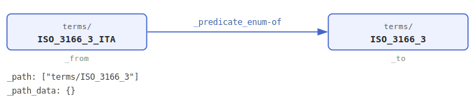
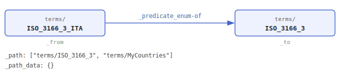
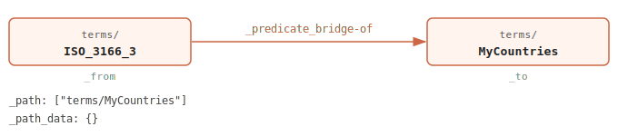

# `_edge`

**`_title`**

Edge

**`_definition`**

An ArangoDB edge document representing a directed relationship between two nodes in the dictionary graph. Edges encode the relationship type, graph membership, and optional relationship-specific data for a source–destination pair.

**`_description`**

Edges are the building blocks of all graphs in the data dictionary. Each edge connects a [source node](_from.md) (`_from`) to a [destination node](_to.md) (`_to`) via a typed [relationship](_predicate.md) (`_predicate`), and declares which [graphs](_path.md) traverse it (`_path`). The `_path_data` [property](_path_data.md) carries any data associated with the relationship within a specific graph or node context.

Edge documents are uniquely identified by their [source](_from.md), [predicate](_predicate-md), and [destination](_to.md): no two edges may share the same `_from`/`_predicate`/`_to` combination. The document key is computed as the MD5 hash of the string formed by joining `_from`, `_predicate`, and `_to` with `/` separators.

Most predicates follow a *many-to-one* direction: `_from` is the leaf node (child, element, member) and `_to` is the root node (parent, container, category).

**`_examples`**

**Basic edge** — Italy is a valid element of the ISO 3166-3 vocabulary:



**Shared edge** — the same edge also belongs to a second graph, `MyCountries`. Adding `MyCountries` to `_path` is all that is needed; no new edge document is created:



The bridge edge connects `MyCountries` to the full ISO 3166-3 vocabulary:



---

**`_code`**

```json
{
  "_aid" : [
    "edge"
  ],
  "_gid" : "_edge",
  "_lid" : "edge",
  "_nid" : ""
}
```

**`_data`**

```json
{
  "_scalar" : {
    "_kind_object" : [
      "_edge"
    ],
    "_type" : "_type_object"
  }
}
```

**`_rule`**

```json
{
  "_computed" : [
    "_key"
  ],
  "_default-value" : {
    "_path_data" : {

    }
  },
  "_immutable" : [
    "_key",
    "_from",
    "_to",
    "_predicate"
  ],
  "_required" : {
    "_selection-descriptors_all" : [
      "_key",
      "_from",
      "_to",
      "_predicate",
      "_path",
      "_path_data"
    ]
  }
}
```
